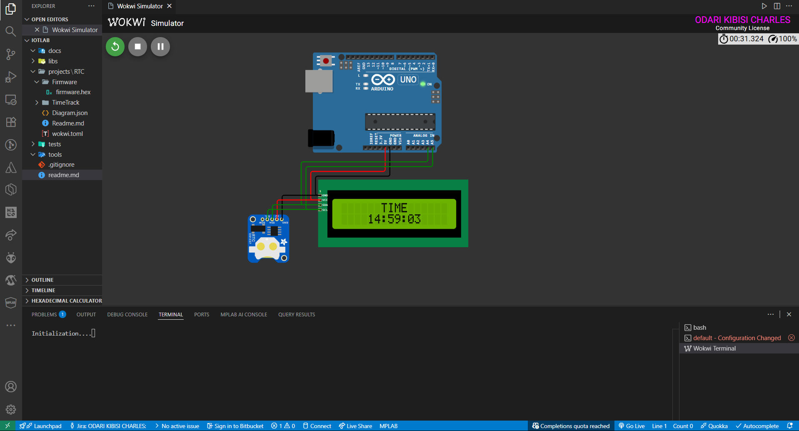

# TimeTrack - Real-Time Clock Display

This Arduino project displays the current time on a 16x4 LCD screen using a DS1307 Real-Time Clock (RTC) module.

## Hardware Requirements

- Arduino Uno (or compatible board)
- 16x4 LCD display with I2C interface (LiquidCrystal_I2C)
- DS1307 RTC module
- Jumper wires for connections

## Circuit Connections

- LCD VCC → Arduino 5V
- LCD GND → Arduino GND
- LCD SDA → Arduino A4
- LCD SCL → Arduino A5
- RTC VCC → Arduino 5V (shared with LCD)
- RTC GND → Arduino GND (shared with LCD)
- RTC SDA → Arduino A4 (shared with LCD)
- RTC SCL → Arduino A5 (shared with LCD)

## Software Requirements

- Arduino IDE
- Required libraries:
  - LiquidCrystal_I2C
  - Wire
  - TimeLib
  - DS1307RTC

## Installation

1. Install the required libraries in Arduino IDE (Sketch > Include Library > Manage Libraries)
2. Open TimeTrack.ino in Arduino IDE
3. Select the correct board and port
4. Upload the sketch to your Arduino

## Usage

Once uploaded, the LCD will display "TIME" on the first line and the current time in HH:MM:SS format on the second line. The time updates every second.

## Simulation

This project includes Wokwi simulation files. You can simulate it online at [Wokwi](https://wokwi.com).

## Firmware

Pre-compiled firmware is available in the Firmware folder for direct upload if needed.
